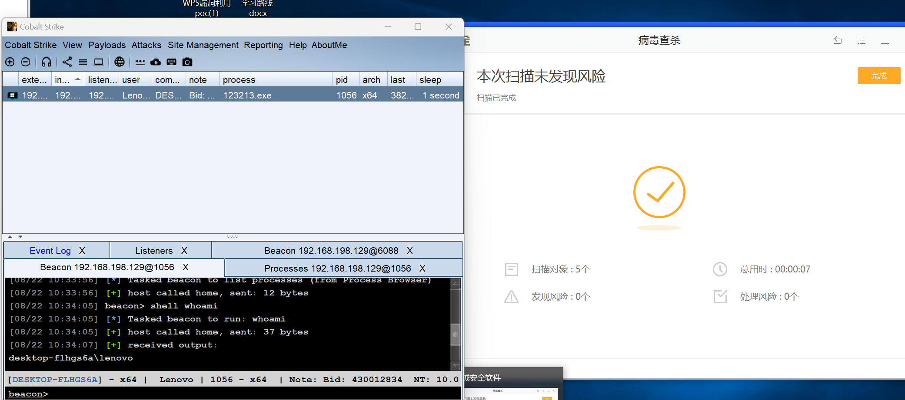
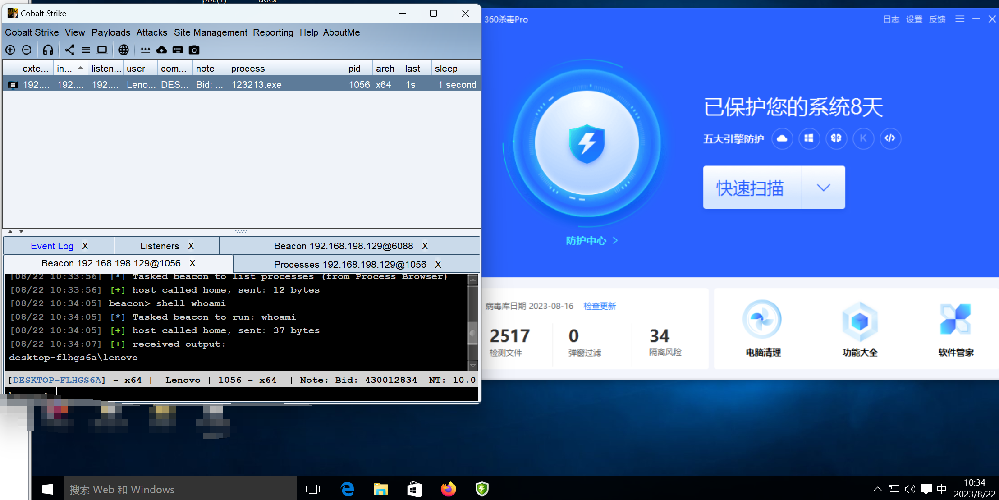
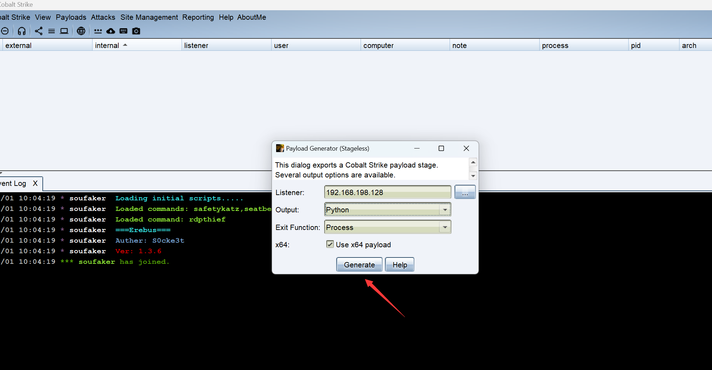
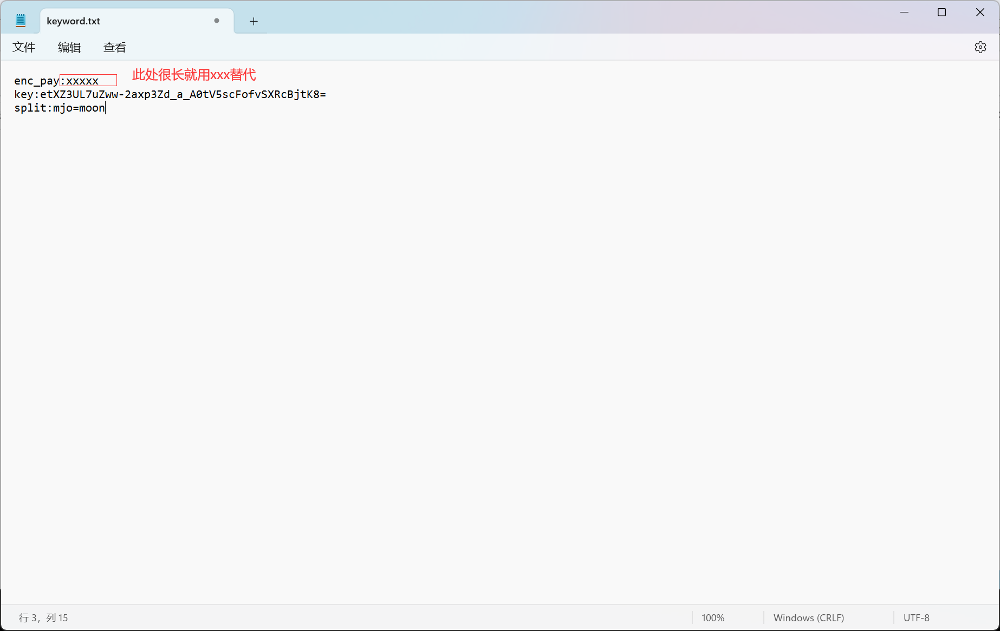
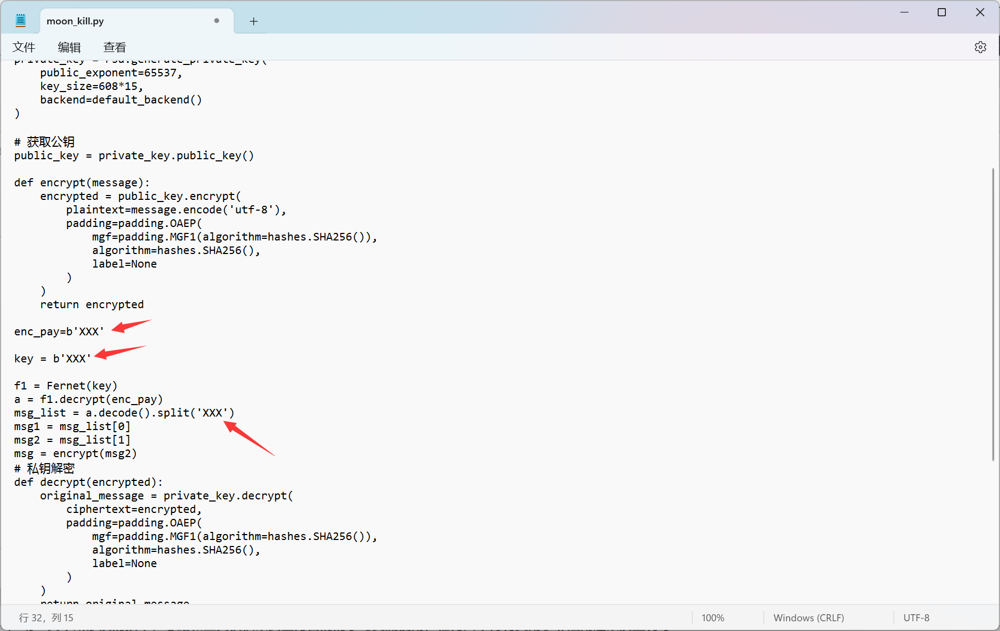
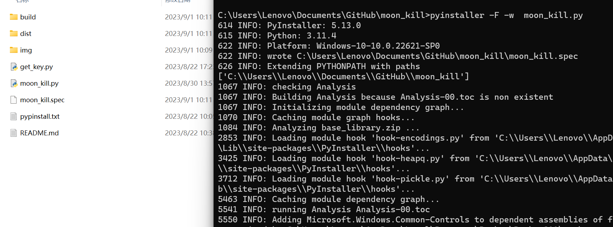

MOON_KILL免杀

分享一款免费的shell_code免杀加载器,该项目持续更新

# 目前可过360杀毒,火绒等国内主流杀毒软件

火绒

360杀毒:

# 食用方式:

1.使用cs或者msf生成payload.py,这里演示cs的

2.将payload.py放入主文件夹下,使用python3 get_key.py生成三个密钥,enc_pay,key,split:

3.将生成的密钥依次填写到主代码moon_kill.py对应的变量里就好了(上面生成的值替换xxx就行),然后运行pyinstaller -F -w  moon_kill.py就可以了

